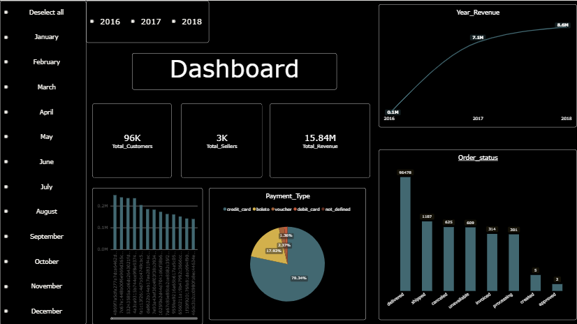

# Brazil E-Commerce Data Analysis

End-to-end analysis of the Brazilian E-Commerce Public Dataset by Olist using SQL, Python, Excel, and Power BI.



## Project Overview

This project explores marketplace performance, customer behavior, sales trends, delivery performance, seller performance, product categories, freight costs, and geographic patterns across approximately 100,000 Olist orders.

The workflow runs from raw CSV data through MySQL data-quality checks and SQL analysis, then uses Python, Excel, and Power BI to explore and communicate findings.

## Questions Explored

- How have order volume and sales changed over time?
- What share of customers place repeat orders?
- Which product categories and sellers generate the most sales?
- How do delivery times and delays relate to customer reviews?
- Which Brazilian states generate the most orders and revenue?
- How significant are freight costs, and which payment methods are most common?
- What are the marketplace's average order value and overall delivery rate?

## Dataset

The project uses the [Brazilian E-Commerce Public Dataset by Olist](https://www.kaggle.com/datasets/olistbr/brazilian-ecommerce). The source CSV files are included in [`data/`](data/):

| File | Contents |
| --- | --- |
| `olist_customers_dataset.csv` | Customer IDs and location |
| `olist_orders_dataset.csv` | Order status and timestamps |
| `olist_order_items_dataset.csv` | Products, sellers, prices, and freight per order item |
| `olist_order_payments_dataset.csv` | Payment types and values |
| `olist_order_reviews_dataset.csv` | Customer review scores and comments |
| `olist_products_dataset.csv` | Product attributes and category names |
| `olist_sellers_dataset.csv` | Seller IDs and location |
| `olist_geolocation_dataset.csv` | Brazilian postal-code coordinates |
| `product_category_name_translation.csv` | Portuguese-to-English category names |

## Tools

| Tool | Use |
| --- | --- |
| MySQL | Relational storage and querying |
| SQL | Data loading, validation, KPI calculation, and analysis |
| Python (pandas, NumPy, Matplotlib, Seaborn, Plotly) | Data preparation, exploration, and visualization |
| Excel | Supporting analysis |
| Power BI | Interactive reporting |
| Docker on Ubuntu Server | MySQL environment used by the project |

## Results

### Marketplace KPIs

| KPI | Result |
| --- | ---: |
| Orders | 99,441 |
| Unique customers | 96,096 |
| Product revenue | 13,591,643.70 |
| Freight | 2,251,909.54 |
| Gross order value (product revenue + freight) | 15,843,553.24 |
| Average order value | 160.58 |
| Average review score | 4.09 / 5 |
| Cancellation rate | 0.63% |
| Delivery rate | 97.02% |

Values are reported as calculated in the project; the average order value includes product price and freight. The delivery and cancellation rates use delivered or canceled orders divided by total orders, respectively.

### Order and Delivery Findings

| Order status | Orders |
| --- | ---: |
| Delivered | 96,478 |
| Shipped | 1,107 |
| Canceled | 625 |
| Unavailable | 609 |
| Invoiced | 314 |
| Processing | 301 |
| Created | 5 |
| Approved | 2 |

For the delivery-timing analysis, 96,476 delivered orders were evaluated against their estimated delivery dates. Of these, 88,649 were on time and 7,827 were late: an on-time rate of 91.89%, a late rate of 8.11%, and an average delivery time of 12.4 days.

### Sales Growth

Completed sales grew substantially from 2016 to 2018.

| Year | Orders | Product sales | Freight | Total sales |
| --- | ---: | ---: | ---: | ---: |
| 2016 | 267 | 40,470.98 | 6,182.76 | 46,653.74 |
| 2017 | 43,428 | 5,962,902.01 | 958,633.23 | 6,921,535.24 |
| 2018 | 52,783 | 7,218,125.12 | 1,233,459.65 | 8,451,584.77 |

### Other Findings

- Health & Beauty, Watches & Gifts, and Bed, Bath & Table are among the highest-revenue product categories.
- São Paulo (SP) leads the state-level order and revenue analysis.
- Freight totals approximately 2.25 million, compared with approximately 13.59 million in product revenue.
- Customer analysis distinguishes one-time customers from repeat customers using distinct orders per `customer_unique_id` and identifies top customers by spend.
- Seller analysis compares order count, revenue, units sold, average revenue per order, and average review score.

## Analysis and Deliverables

### SQL

SQL is the main analytical layer. Scripts are in [`SQL/`](SQL/) and are organized by task:

| Script | Purpose |
| --- | --- |
| [`table_creation.sql`](SQL/table_creation.sql) | Create the MySQL tables |
| [`data_load.sql`](SQL/data_load.sql) | Load source CSVs with `LOAD DATA INFILE` and convert empty date fields to `NULL` |
| [`01_data_quality.sql`](SQL/01_data_quality.sql) | Check row counts, duplicate IDs, missing values, and table consistency |
| [`02_order_analysis.sql`](SQL/02_order_analysis.sql) | Analyze status, time trends, customers, delivery, and reviews |
| [`03_sales_analysis.sql`](SQL/03_sales_analysis.sql) | Analyze categories, sellers, freight, and state-level results |
| [`kpis.sql`](SQL/kpis.sql) | Calculate marketplace KPIs |

The source data was checked for row counts, duplicate IDs, required order-field completeness, and table-level consistency. Reported row counts include 99,441 customers, 99,441 orders, 112,650 order items, 3,095 sellers, 32,951 products, 71 categories, 103,886 payments, and 99,224 reviews. No duplicate IDs were identified in the checked `order_id`, `customer_id`, `seller_id`, and `product_id` fields. No missing values were found in the checked order ID, customer ID, order status, and purchase timestamp fields.

`data_load.sql` uses MySQL's `LOAD DATA INFILE`; update the server-side CSV paths and MySQL import permissions for your own environment before running it. The project database was run in a Docker container on an Ubuntu server.

### Python and Excel

The [data-cleaning notebook](NoteBooks/data_cleaning.ipynb) covers data preparation and exploratory analysis. The [`Excel/`](Excel/) folder contains a supporting workbook. Python visualizations explore seller sales, payment methods, state-wise customer distribution, sales trends, and product categories.

Install the listed Python packages with:

```bash
pip install -r requirements.txt
```

### Power BI

The interactive report is [`PowerBI/Brazil_Ecom.pbix`](PowerBI/Brazil_Ecom.pbix). Its focus includes orders, revenue, freight, average order value, customer metrics, sales trends, product categories, geography, sellers, and delivery performance.

### Visualizations

| Preview | File |
| --- | --- |
| Dashboard | [`reports/figure/Dashboard.png`](reports/figure/Dashboard.png) |
| Top 10 seller sales | [`reports/figure/seller_Sales_top_10.png`](reports/figure/seller_Sales_top_10.png) |
| Payment methods | [`reports/figure/Payment_methods.png`](reports/figure/Payment_methods.png) |
| Customer distribution across Brazil | [`reports/figure/state_wise_customers.png`](reports/figure/state_wise_customers.png) |

## Repository Structure

```text
.
├── data/                 # Olist source CSV files
├── Excel/                # Supporting analysis workbook
├── NoteBooks/            # Data-cleaning and analysis notebook
├── PowerBI/              # Power BI report
├── reports/figure/       # Exported dashboard and analysis figures
├── SQL/                  # Schema, loading, quality, analysis, and KPI scripts
├── requirements.txt      # Python dependencies
└── README.md
```

## Skills Demonstrated

- SQL joins, CTEs, CASE expressions, subqueries, window functions, date functions, conditional aggregation, and `COUNT(DISTINCT)`
- Data loading, cleaning, validation, and KPI development
- Exploratory analysis, trend analysis, and visualization
- Customer, sales, product, seller, delivery, and geographic analysis
- Translating analysis into business insights and dashboard reporting

## Possible Extensions

- RFM customer segmentation, retention, churn, and lifetime-value analysis
- Sales forecasting and product profitability analysis
- Seller benchmarking and deeper delivery-delay/review-score analysis
- Additional Power BI drill-through pages
- Interactive customer segmentation dashboard

